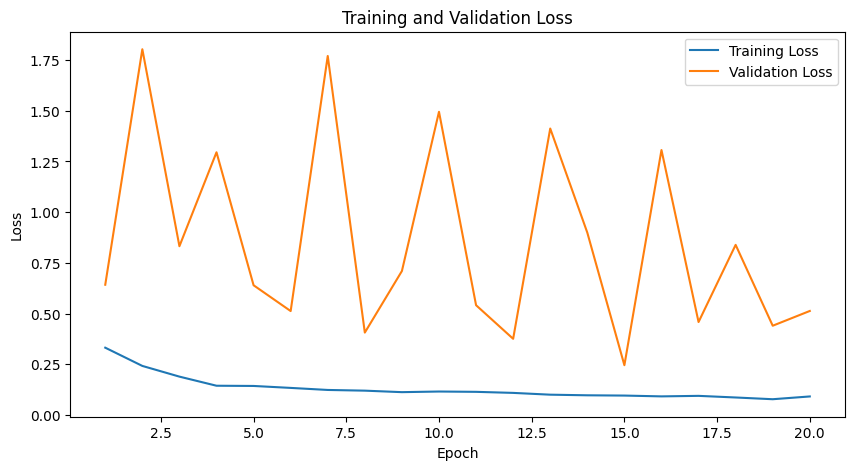
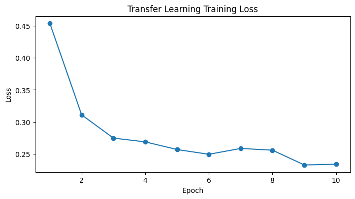
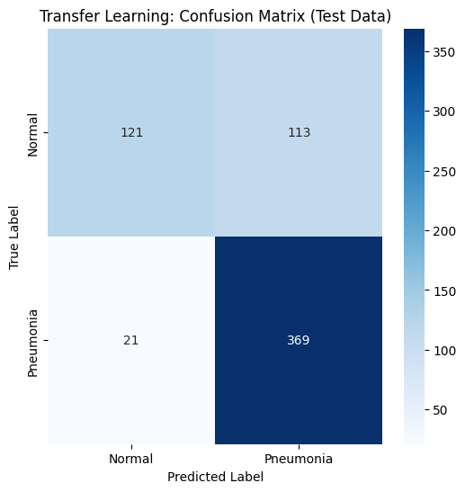
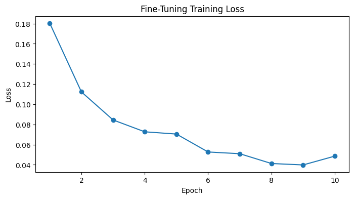

## Part 1: Transfer Learning

### 1.1. Data Loading and Distribution

### What We Did:
In this step, we loaded the dataset from the **train** and **test** directories, which contain images categorized into **NORMAL** (healthy chest X-rays) and **PNEUMONIA** (chest X-rays with pneumonia). We identified the paths for these datasets and counted the number of images in each category for both the training and testing sets.

### Results:
- **Training Set:**
  - **NORMAL** images: 1341 images
  - **PNEUMONIA** images: 3875 images
- **Test Set:**
  - **NORMAL** images: 234 images
  - **PNEUMONIA** images: 390 images

As observed, the dataset is **imbalanced**, with **PNEUMONIA** images significantly outnumbering **NORMAL** images, especially in the training set. This imbalance could potentially lead to a biased model that may perform better on the **PNEUMONIA** class due to the larger number of samples. Addressing this imbalance is crucial to ensure that the model learns to identify both classes accurately. Techniques such as **data augmentation** or **class weighting** can help mitigate this bias.

---

## 2.1. CNN Model

### What We Did:
We defined a **Convolutional Neural Network (CNN)** with more than 18 layers. The model consists of several blocks of convolutional layers, followed by Batch Normalization, ReLU activation, and Max Pooling layers. The primary purpose of this model is to classify X-ray images into two categories: **NORMAL** and **PNEUMONIA**.

1. **Batch Normalization Layer**:
   - Batch Normalization is added to each convolutional block to **speed up the training process** and make the network more stable. It works by normalizing the inputs from the previous layer, ensuring that the data passed through the network maintains a stable distribution during training.
   
2. **ReLU Activation**:
   - **ReLU (Rectified Linear Unit)** is used after each convolution operation. It helps introduce non-linearity into the network, enabling it to learn complex patterns. It outputs zero for negative values and the input itself for positive values, which helps with efficient learning.

3. **Max Pooling Layer**:
   - Max pooling is used after each set of convolutions to **downsample** the image and reduce the spatial dimensions. This helps the network focus on important features while decreasing computational complexity.

4. **Dropout Layer**:
   - Dropout is applied in the fully connected layers to prevent **overfitting** by randomly setting some input units to zero during training. This forces the model to learn more robust features.

5. **Fully Connected Layers**:
   - After several convolutional and pooling layers, the network is flattened and passed through fully connected layers. These layers are responsible for making the final prediction. The model uses two hidden layers, each with 4096 units, followed by a final output layer with **two units** (representing **NORMAL** and **PNEUMONIA** classes).

The **VanillaCNN** model consists of multiple blocks of convolutional layers followed by batch normalization and ReLU activation to learn complex features from the input images. Dropout layers are used to prevent overfitting, and the final classification is done using fully connected layers. This structure allows the model to effectively classify X-ray images into two categories.

---
## 2.1.2. Running The Model

### What We Did:
Before running the model, we addressed the **class imbalance problem**. Several techniques such as **class weighting** or **oversampling** could be used to handle this. Once the data was prepared, the model was moved to the appropriate device (GPU or CPU). We initialized the **VanillaCNN** model, transferred it to the device, and proceeded with the training.

The **CrossEntropyLoss** was used as the criterion, and the **Adam optimizer** was selected for training. The model was trained for 20 epochs.

---

## 2.1.3. Plotting Training and Validation Loss

### What We Did:
After training the model, we plotted the **training loss** and **validation loss** curves to visualize how the model's performance improved over time and how well it generalized to unseen data.

Here is the loss curve showing both **Training Loss** and **Validation Loss**:

The **training loss** decreased consistently, indicating that the model was learning to classify the images. The **validation loss**, although fluctuating, also decreased over time, suggesting that the model was generalizing well. However, if the validation loss increases while training loss continues to decrease, it would indicate **overfitting**. Fortunately, that was not the case here.

---

## 2.1.4. Evaluating the Model

### What We Did:
After training, the model was evaluated on the test dataset. The accuracy of the model was calculated by comparing the predicted labels with the true labels.

### Results:
- The model achieved a **Test Accuracy** of **77.56%** on the test dataset.

A test accuracy of **77.56%** indicates that the model is performing reasonably well, but there is room for improvement. Factors such as the **imbalanced dataset** or further hyperparameter tuning (e.g., learning rate, batch size) could help improve the model’s performance. Additionally, exploring more complex architectures or data augmentation techniques could further enhance accuracy.

---

## 3.1. Transfer Learning

### 3.1.1. Pre-trained Models

### What We Did:
In this step, we used a **pre-trained model**  to perform the classification task. Transfer learning allows us to leverage models that have been trained on large datasets (such as ImageNet) and fine-tune them for our specific task.

We used **VGG16**, a popular deep convolutional network model, which is pre-trained on a large number of images. For this task, we froze the pre-trained layers of the model and only trained the classifier layer.

### 3.1.2. Running the Model (Transfer Learning with Frozen Pre-trained Layers)

### What We Did:
The model's pre-trained layers were frozen, and we replaced the last fully connected layer to match the number of output classes (2 classes: **NORMAL** and **PNEUMONIA**). We trained only the new classifier layer using the **Adam optimizer** and **CrossEntropyLoss** as the criterion.

We trained the model for **10 epochs** and monitored the training loss at each epoch.

The model showed a steady decrease in loss over the 10 epochs:

After training the model, we evaluated its performance on the test dataset. We used a **confusion matrix** to visualize how well the model was able to classify the test images into **NORMAL** and **PNEUMONIA** categories. We also calculated the **Test Accuracy**.

The confusion matrix for the test data is as follows:

#### Test Accuracy:
- The model achieved a **Test Accuracy** of **78.53%** on the test dataset.

The confusion matrix shows the number of correct and incorrect classifications for both **NORMAL** and **PNEUMONIA** classes. The **accuracy** value of **78.53%** indicates a good performance, but there is still room for improvement, especially in handling misclassified instances.

---

## 4.1. Fine-tuning Models

### What We Did:
When using pre-trained models, we initially froze all layers to use them for feature extraction. However, in **fine-tuning**, we unfreeze the later layers and retrain them on our specific task (e.g., **classification of pneumonia vs. normal**). This allows the model to adapt to the new dataset while keeping the generic features learned from large datasets like ImageNet.

We performed fine-tuning by:
- Freezing the initial layers of the pre-trained model (VGG16).
- Unfreezing the later layers (starting from layer 24).
- Updating the last fully connected layer to match the number of output classes (2 classes: **NORMAL** and **PNEUMONIA**).
- Fine-tuning these unfrozen layers using the **Adam optimizer** with **CrossEntropyLoss**.

---

## 4.2. Fine-tuning the Model (Unfreezing Later Layers)

### What We Did:
We unfreezed some layers (starting from layer 24 onwards) to allow the model to fine-tune those layers while keeping the lower layers frozen. We used the **VGG16** model for transfer learning and retrained the unfrozen layers over **10 epochs**.

The training process showed a steady decrease in the loss for each epoch:

- The **training loss** decreased significantly over the epochs, showing that the model adapted to the new task effectively after unfreezing the layers. 
- The loss reached a steady low after 10 epochs, indicating that the model was successfully fine-tuned to the dataset.

---

## 4.3. Evaluating the Model with a Confusion Matrix

### What We Did:
After fine-tuning, the model was evaluated on the test dataset. We used a **confusion matrix** to visualize how well the model classified the images into **NORMAL** and **PNEUMONIA** categories.

We also calculated the **Test Accuracy**:

### Results:
The confusion matrix for the test data is as follows:

#### Test Accuracy:
- The fine-tuned model achieved a **Test Accuracy** of **77.40%** on the test dataset.

The confusion matrix shows the correct and incorrect classifications for both **NORMAL** and **PNEUMONIA** categories. The **Test Accuracy** of **77.40%** is a good result, but there is still room for improvement, especially in terms of reducing false positives and false negatives.
